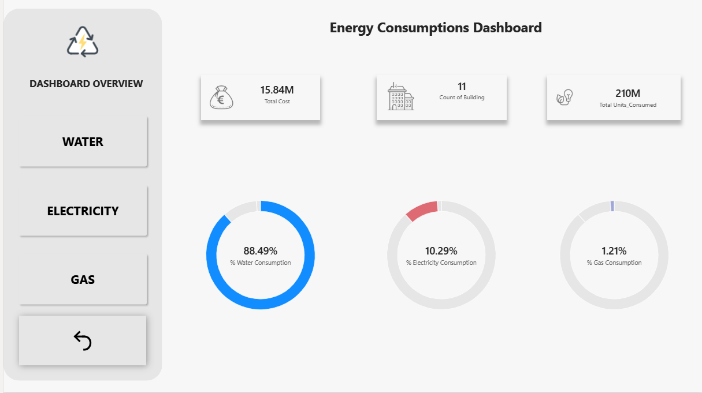
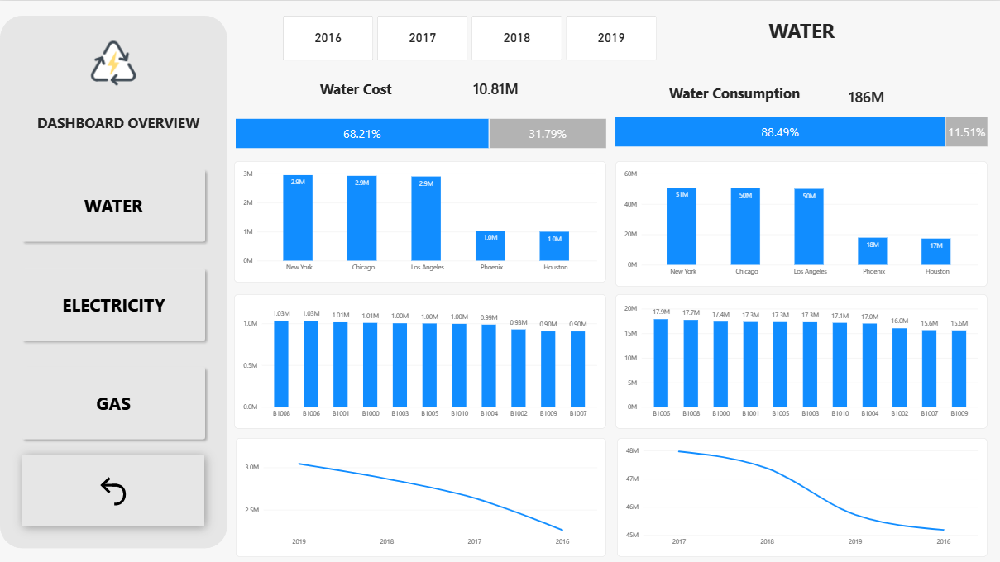
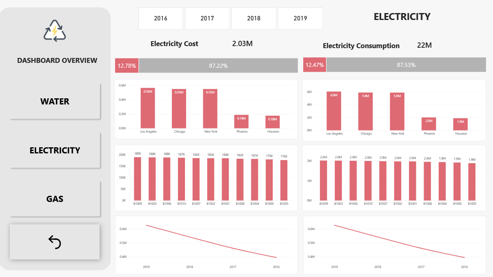
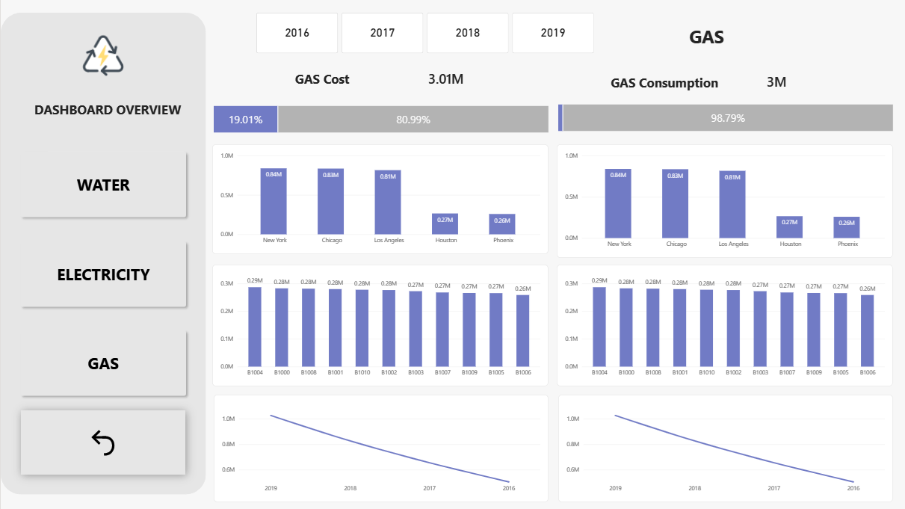

# ⚡ Energy Consumptions Dashboard | Power BI

An interactive Power BI dashboard analyzing **Water, Electricity, and Gas** consumption and cost across **11 buildings in 5 U.S. cities**, from **2016 to 2019** — turning 528 monthly utility-meter records into a single, decision-ready view of where energy is used, what it costs, and how that cost is trending.

## 📌 Project Overview

Facility and operations teams managing a multi-building portfolio rarely struggle to *collect* utility data — they struggle to *see* it in one place, broken down by building, by city, and by year, with cost and consumption side by side.

This project takes raw monthly meter readings for three utility types (water, electricity, gas) plus a yearly price table, models them into a proper analytical schema, and turns them into a 4-page Power BI dashboard: one consolidated overview and one deep-dive page per utility.

### Dashboard Scope

- 🏠 **Dashboard Overview** — total cost, building count, total units consumed, and a consumption-mix breakdown across the three utilities
- 💧 **Water** page — cost & consumption by city and by building, plus the 4-year trend
- ⚡ **Electricity** page — cost & consumption by city and by building, plus the 4-year trend
- 🔥 **Gas** page — cost & consumption by city and by building, plus the 4-year trend
- 📅 **Year slicer** (2016–2019) on every page for period-specific analysis
- 🧭 Consistent left-hand navigation panel across all four pages

## 🎯 Project Objectives

- Consolidate three separate utility-consumption streams (water, electricity, gas) into a single analytical model
- Apply year-specific unit pricing to raw consumption volumes to calculate actual cost, not just usage
- Compare cost and consumption across cities, buildings, and years to spot the biggest drivers of utility spend
- Package the analysis into a clean, self-service dashboard that a facilities or finance stakeholder can filter and explore without touching the underlying data

## 📂 Dataset

The source workbook contains three related tables:

| Table | Grain | Rows | Description |
|---|---|---|---|
| `Energy Consumptions` | 1 row per building per month | 528 | Date, Building, Water/Electricity/Gas consumption (units) |
| `Building Master` | 1 row per building | 11 | Building ID → City → Country |
| `Rates` | 1 row per year per utility | 15 | Year, Energy Type, Price Per Unit |

**Coverage:** 11 buildings (`B1000`–`B1010`) across **New York, Los Angeles, Chicago, Houston and Phoenix**, with 48 consecutive months of readings (January 2016 – December 2019).

**Pricing model:** unit rates for all three utilities step up every year (e.g. Electricity: $0.080 → $0.088 → $0.097 → $0.106 per unit, 2016→2019), so cost growth over the period is driven both by consumption and by the rising price per unit.

## 🏗️ Data Model

The report is built on a small star schema:

```
Building Master (dimension)
        │
        ▼
Energy Consumptions (fact — Date, Building, Water/Electricity/Gas units)
        ▲
        │
     Rates (dimension — Year, Energy Type, Price Per Unit)
```

- `Building Master` relates to the fact table on `Building`, driving the city-level breakdowns
- `Rates` relates to the fact table on `Year` (and utility type), enabling cost to be calculated as *consumption × the price that applied in that year* rather than a single flat rate
- A `Year` slicer (2016–2019) filters every visual on a page simultaneously

## 🧮 DAX & Calculations

Core measures built for the model include:

- **Cost per utility** = `SUMX` over the fact table, multiplying each month's consumption by the matching year's `Price Per Unit` from the `Rates` table
- **Total Cost / Total Units Consumed** — portfolio-wide KPIs shown on the overview page
- **% Consumption by utility type** — the donut breakdown on the overview page
- **Cost share bars** (e.g. *"12.78% / 87.22%"* on the Electricity page) — each utility's cost or consumption expressed as a share of the total, used as a quick-read progress indicator
- **City-level and building-level aggregations** — `SUM` of cost/consumption grouped by `City` (via `Building Master`) and by `Building`
- **Year-over-year trend** — cost and consumption plotted across 2016→2019 for each utility

## 🖼️ Dashboard Pages

### 🏠 Dashboard Overview



The landing page rolls the entire portfolio up into three headline KPIs — **Total Cost: 15.84M**, **Count of Building: 11**, **Total Units Consumed: 210M** — followed by a consumption-mix donut per utility: **Water 88.49%**, **Electricity 10.29%**, **Gas 1.21%**. Water dominates consumption volume by a wide margin, which sets up the cost-vs-consumption contrast explored on the following pages.

### 💧 Water



**Water Cost: 10.81M** (68.21% of total cost) against **Water Consumption: 186M units** (88.49% of total consumption) — water is by far the largest cost line in the portfolio. New York, Chicago and Los Angeles each consume roughly **50–51M units**, well ahead of Phoenix and Houston (~17–18M). At the building level, usage is fairly even (0.90M–1.03M per building), and the 4-year trend line shows both cost and consumption declining steadily from 2019 back to 2016.

### ⚡ Electricity



**Electricity Cost: 2.03M** (12.78%) against **Electricity Consumption: 22M units** — a smaller slice of the portfolio than water, but still led by the same three hub cities (Los Angeles, Chicago, New York at 5.5–6.0M units each) versus Phoenix and Houston (~1.9–2.0M). Building-level consumption is tightly clustered around 1.9M–2.0M units, and — like water — both cost and consumption trend downward from 2019 to 2016.

### 🔥 Gas



**Gas Cost: 3.01M** (19.01%) against **Gas Consumption: 3M units** (1.21% of total consumption) — gas is the smallest volume utility but a disproportionately larger share of cost, reflecting its higher per-unit price. New York, Chicago and Los Angeles again lead usage (0.81M–0.84M units) ahead of Houston and Phoenix (0.26–0.27M), with the same declining trend across 2016–2019.

## 💡 Key Insights

1. **Water drives volume, gas drives price sensitivity.** Water accounts for ~88% of total units consumed but "only" ~68% of cost, while gas is just ~1% of volume yet ~19% of cost — its per-unit rate is far higher than water's.
2. **Three cities concentrate most of the portfolio's usage.** New York, Los Angeles and Chicago consistently lead all three utilities, with Phoenix and Houston running at roughly a third of that volume across the board.
3. **Cost has grown faster than consumption.** All three utilities show declining consumption when read from 2019 back to 2016, yet unit rates rose ~10% per year over the same period — meaning cost pressure on the portfolio has been driven more by pricing than by usage growth.
4. **Building-level usage is remarkably even.** Within any given utility, individual buildings cluster tightly around the same consumption band, so city and location — not building-specific anomalies — are the main drivers of variance.

## 🛠️ Tools & Technologies

| Technology | Purpose |
|---|---|
| 📊 Power BI | Data modeling, DAX and dashboard visualization |
| 🔄 Power Query | Data shaping and table relationships |
| ⚡ DAX | Cost calculations, KPIs and share measures |
| 🗄️ Excel | Source dataset (consumption, building master, rates) |
| 🐙 GitHub | Project documentation and version control |

## 📁 Repository Structure

```
Energy-Consumptions-Dashboard/
│
├── Power BI Report/
│   └── Energy_Consumptions.pbix
│
├── Dataset/
│   └── Energy_Consumptions_Dataset.xlsx
│
├── Images/
│   ├── dashboard-overview.png
│   ├── water-analysis.png
│   ├── electricity-analysis.png
│   └── gas-analysis.png
│
└── README.md
```

## 🚀 Future Improvements

- Add a budget/target line to compare actual cost against a planned utility budget per building
- Bring in weather data (temperature/degree-days) to explain seasonal swings in consumption
- Add a per-building, per-square-foot efficiency metric for fair cross-building comparison
- Extend the Rates table with forecasted future pricing for basic what-if cost projection

## 👨‍💻 About Me

Hi! I'm **Mohamed Farag Saied** — an ERP Systems & Data Analytics Specialist working across Data Engineering, Odoo, SAP, and PowerBuilder development.

My toolkit includes:

**Power BI | Odoo | SAP | PowerBuilder | Python | SQL | Flutter**

I'm passionate about turning data into actionable insights and building systems that support better business decisions.

## 🙏 Special Thanks

طبعاً شكر خاص لـ [Shimaa Ezzat Tohamy](https://www.linkedin.com/in/shimaa-ezzat-tohamy/)، [Alaa Essam](https://www.linkedin.com/in/alaaessam799/)

## ⭐ Project

If you found this project useful or interesting, feel free to ⭐ the repository.
